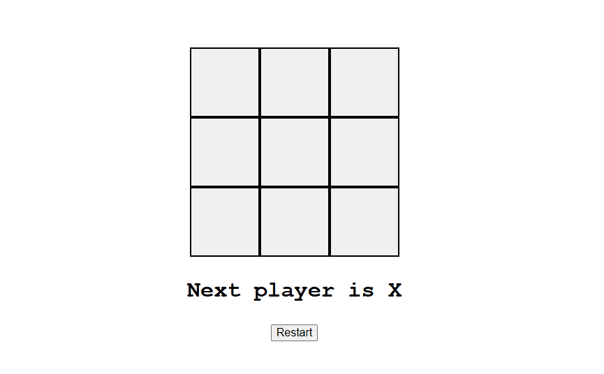

# 🕹️ Tic Tac Toe - React + Vite  

> 🎮 A simple implementation of the classic Tic Tac Toe game built with React and Vite.  
> (ES) Una implementación simple del clásico juego Tic Tac Toe creado con React y Vite.

<br>

## 📌 Description / Descripción

**EN**  
This is a simple two-player Tic Tac Toe game created as part of my learning path in React. It's based on a freeCodeCamp tutorial, with some minor personal touches and style customizations. The game logic is basic and requires two people to play on the same device. The game interface and messages are in Spanish.

**ES**  
Este es un sencillo juego de tres en línea para dos personas, creado como parte de mi proceso de aprendizaje en React. Está basado en un tutorial de freeCodeCamp, al cual le realicé pequeños cambios personales y personalización de estilos. La lógica del juego es básica y requiere dos jugadores en el mismo dispositivo. La interfaz y los mensajes del juego están en español.

<br>

## 🎥 Demo - You can try this game live [here](https://codenamecoffee.github.io/TicTacToe_React/) / Puedes probar el juego en vivo [aquí](https://codenamecoffee.github.io/TicTacToe_React/) 



<br>

## ⚙️ How to Run / Cómo ejecutar

### With Yarn:

```bash
yarn
yarn run dev
```

### With NPM:

```bash
npm install
npm run dev
```

<br>

> Then open your browser and visit the local server URL provided in the terminal (usually `http://localhost:5173`).

<br>

🚀 Technologies Used / Tecnologías utilizadas

* React

* Vite

* JavaScript

* CSS

<br>

🧠 Potential Improvements / Posibles mejoras

* Add a dark/light mode toggle

* Allow to restart the game without refreshing

* Implement a single-player mode with AI

* Track wins/losses and draw statistics

<br>
    
📚 Credits / Créditos

Based on a freeCodeCamp tutorial on YouTube, with personal modifications and styling.

<br>

✍️ Created by Federico González
